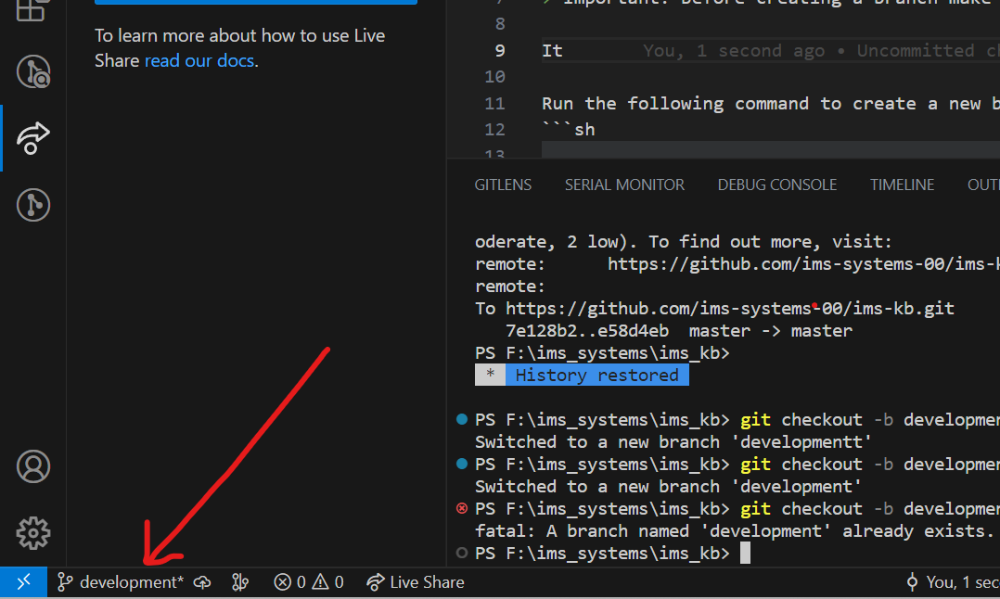
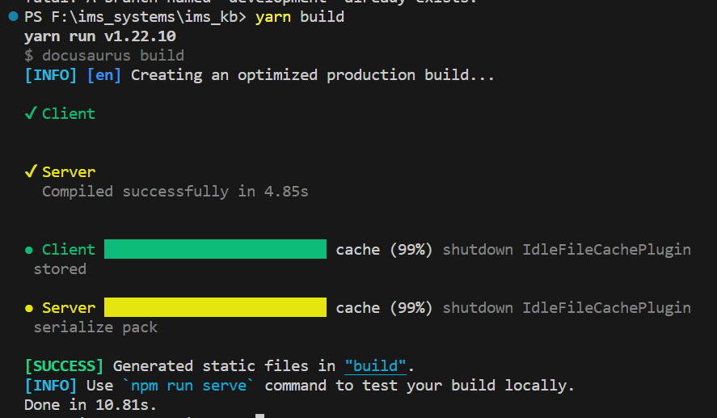

## Contribution guidelines

### How to do amend documentation?

Comming soon...

### Get your works published?

Always create branches with a name like this: **docs/anything-dash-seperated-like-this**. You can create branches according to your convenience.

> Important: Before creating a branch make sure you are on the **development** branch.

It will show up here.



If it doesn't show the name **development**, please make sure you checkout to the development branch.

To checkout run follwoing:

```sh
git checkout development
```

Next, run the following command to create a new branch?

```sh
git checkout -b docs/my-nice-documentation-branch-name
```

At the bottom left corner of the vs code screen it should show you the newly created branch name. Remember this branch is always your current working branch.

### How to start the development server?

```sh
yarn start
```

### Where to view the website output?

Go to your favourite browser and type this url **http://localhost:3000/**

### How to publish your work?

Whenever you are comfortable with your works, please follow these steps.

#### Build the project

First make sure the project builds successfully.

Run following command

```sh
yarn build
```

The command line should show something closer to this



With a **success** message `Generated static files`.

If build fails somehow please report to [MD Reyad Hossain](mailto:reyad@imssystems.tech)
and `do not proceed any further`.

#### Prepare the works

Next, if build succeeds it's time to commit your works.

Run this command to stage all files.

```sh
git add .
```

To give your works a nice commit message.

```sh
git commit -m "A meaningful commit message in one or two line that reflect your works."
```

i.e.:

```sh
git commit -m "Finished incident management documentation and added new static images for CIP"
```

After that, please checkout to the **development** branch again (because currently you are in your working branch named **docs/any-nice-name**).

Run following to checkout :

```sh
git checkout development
```

After you checked out to **development** branch, merge your working branch in this branch so that your works can be published.

Run following command:

```sh
git merge docs/the-woking-branch-name
```

You are almost set.

### Let's publish your work

Publishing is quite easy. Just hit the exact same command here.

```sh
git push origin development
```

> Ocassionally it may be a case you fail to publish the first time. In case you come accorss this issue then follow these steps. Otherwise, if successfull skip to [End](#end).

If you find this kind of error or message that is somehow close to this,

```
error: failed to push some refs to 'https://github.com/ims-systems-00/ims-kb.git'
hint: Updates were rejected because the tip of your current branch is behind
hint: its remote counterpart. Integrate the remote changes (e.g.
hint: 'git pull ...') before pushing again.
hint: See the 'Note about fast-forwards' in 'git push --help' for details.
```

run the following command to solve the error.

```sh
git pull origin development
```

> Make sure you are still on development branch

Some updates will be downloaded in your machine.

At this point make sure you build the project again by [following this step](#build-the-project). Finally, proceed to next step.

### Final step

Finally, run this command again

```sh
git push origin development
```

You will see your works have been published after 5 minutes.

### End

Congratulations you are all done.

> Note: Why are we not following standard flow? The reason is so that every **developer** or **semi-developer** can contributte to this repository.
