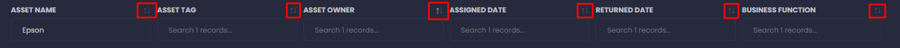
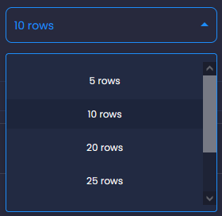

# General Information

## Actions

*Please note that* `Partner` *business functions can only view Assets that they have been given access to AND are owned by their business function.*

### Tables

When browsing a set of data presented on a table, there are a number of ways to search, sort and present the information you are looking at.

#### Search

Each table allows you to search relevant information to find a match. For example, if you are searching for a **Hardware Asset**, you have the option of searching by any of the following
+ Asset Name
+ Asset Tag
+ Asset Owner
+ Assigned Date
+ Returned Date
+ Business Function

#### Sort

Each table also allows you to customise how you wish to sort it. At the moment, you can only sort by A-Z (1-9) and Z-A (9-1) by click the arrow buttons next to the header of each column in the table.

#### Number of Results

You can also adjust the number of rows to display at once. The default number of displayed rows is 10, and the maximum is 100.

### Inventory Management (Assets)

For each `Asset`, you can `Modify` or `Delete` each entry in the `Inventory` system for each individual category.

.png")

#### Modifying an Asset

In order to `Amend` an asset, select the pencil icon under the `Actions` field.

When modifying an Asset, you may be limited by your level of access.

#### Deleting an Asset

In order to `Delete` an Asset, select the trash can icon under the `Actions` field.

When deleting an Asset, you will first be asked to confirm you really wish to delete the asset. Please be warned that deleted assets cannot be easily retrieved and due care is required. Ensure to make regular [backups][Backup] to safely store information in case of an accident.

Simply select `Cancel` to stop the deletion process or `Confirm` in order to delete the Asset.

### Risk Management (Risks)

*Please note that* `Partner` *business functions can only view Risks that they have been given access to AND are owned by their business function.*

For each `Risk`, you can either `Modify`, `Escalate` or `Delete` them, much like with `Assets`.

.png")

#### Modifying a Risk

In order to `Amend` a risk, select the pencil icon under the `Actions` field.

When modifying a Risk, you may be limited by your level of access.

#### Escalating a Risk

When escalating a Risk, you will be first asked to confirm escalation of the Risk. Note that escalating a Risk will notify the Head of Service and Superadmin accounts of the risk that was escalated, as well as the `owner` of the risk.

Simply select `Cancel` to stop the escalation process or `Confirm` in order to escalate the Risk. Once escalated it will appear under the `Escalated` tab in the relevant category.

 
#### Deleting a Risk

In order to `Delete` a Risk, select the trash can icon under the `Actions` field.

When deleting a Risk, you will first be asked to confirm you really wish to delete the risk. Please be warned that deleted risks cannot be easily retrieved and due care is required. Ensure to make regular [backups][Backup] to safely store information in case of an accident.

 
Simply select `Cancel` to stop the deletion process or `Confirm` in order to delete the Risk.

### Incident Management (Incidents)

*Please note that* `Partner` *business functions can only view Risks that they have been given access to AND are owned by their business function.*

For each `Incident`, you can either `Modify`, `Escalate` or `Delete` them, much like with `Assets` and `Risks`.

.png")

#### Modifying an Incident

In order to `Amend` an incident, select the pencil icon under the `Actions` field.

When modifying an Incident, you may be limited by your level of access.

#### Escalating an Incident

When escalating an Incident, you will be first asked to confirm escalation of the Incident. Note that escalating an Incident will notify the Head of Service and Superadmin accounts of the incident that was escalated, as well as the `owner` of the incident.

Simply select `Cancel` to stop the escalation process or `Confirm` in order to escalate the Incident. Once escalated it will appear under the `Escalated` tab in the relevant category.

#### Deleting an Incident

In order to `Delete` an Incident, select the trash can icon under the `Actions` field.

When deleting an Incident, you will first be asked to confirm you really wish to delete the incident. Please be warned that deleted incidents cannot be easily retrieved and due care is required. Ensure to make regular [backups][Backup] to safely store information in case of an accident.

 
Simply select `Cancel` to stop the deletion process or `Confirm` in order to delete the Incident.

### Continual Improvement (OFIs)

*Please note that* `Partner` *business functions can only view OFIs that they have been given access to AND are owned by their business function.*

For each `OFI`, you can either `Modify` or `Delete` them, much like with `Assets`, `Risks` and `Incidents`, however you can also `Implement` an OFI from the `Modify` menu.

.png")

#### Modifying an OFI

In order to `Amend` an OFI, select the pencil icon under the `Actions` field, when finished click on `Update`.

When modifying an OFI, you may be limited by your level of access.

#### Implementing an OFI

In order to `Implement` an incident, select the pencil icon under the `Actions` field, then click the `Implement` button on the right of the `Update` button.

#### Deleting an OFI

In order to `Delete` an OFI, select the trash can icon under the `Actions` field.

When deleting an OFI, you will first be asked to confirm you really wish to delete the OFI. Please be warned that deleted OFIs cannot be easily retrieved and due care is required. Ensure to make regular [backups][Backup] to safely store information in case of an accident.

**I havent put the image in upload, due to the OFI popup saying** "This risk will be deleted".

 
Simply select `Cancel` to stop the deletion process or `Confirm` in order to delete the OFI.

### Task Manager (Tasks)

*Please note that* `Partner` *business functions can only view Tasks that they have been given access to AND are owned by their business function.*

For each `Task`, you can either `Modify` or `Delete` them, much like with `Assets`, `Risks` and `Incidents`, however you can also `Assign` a Task to a user either from the `Modify` menu or during creation of the task itself..

.png")

#### Modifying a Task

In order to `Amend` a Task, select the pencil icon under the `Actions` field and navigate to the tab named `Amend task`. When finished, to save your changes click on `Update`.

If you wish to mark a task as *completed* click on the `Complete` button instead of `Update`.

When modifying a Task, you may be limited by your level of access.

#### Deleting a Task

In order to `Delete` a Task, select the trash can icon under the `Actions` field.

When deleting a Task, you will first be asked to confirm you really wish to delete the OFI. Please be warned that deleted Tasks cannot be easily retrieved and due care is required. Ensure to make regular [backups][Backup] to safely store information in case of an accident.

 
Simply select `Cancel` to stop the deletion process or `Confirm` in order to delete the Task.

### Calendar (Events)

For each `Event` you can either `Modify` or `Delete` them.

#### Colour Scheme

+ &nbsp;Red  = P1 Incident
+ &nbsp;Azure  = Management Review
+ &nbsp;Green  = Scheduled Audits
+ &nbsp;Orange  = Supplier Review
+ &nbsp;Grey  = Personal/Custom Events

#### Modifying an Event

In order to `Amend` the details of an Event, you must first find the event you wish to change the details of then click on the name of the Event. The event details should popup in a form that can be edited, edit the details you wish to change and click on `Update` to save your changes.

**Please note that if the event is not a personal/custom event that you have created within the Calendar you may not be able to edit certain details.**

![Modify Calendar Event]["Calendar_Modify_Actions.png"]

#### Deleting an Event

In order to `Delete` an Event, you must first find th eevent you wish to delete, then click on the name of the Event. The event details should popup in a form. From here, click on the `Delete` button and the event will be deleted.

**If you cannot find a Delete button, the event you are attempting to delete is not a personal/custom event that you have created.**

[Backup]: link/to/backup/guide "Link to Backup Guide" **not yet made**